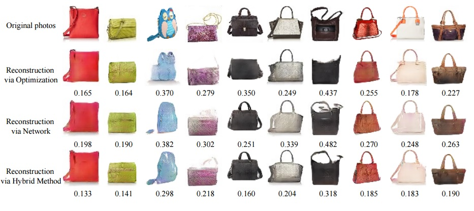

## Accurate_GAN: Interactive Image Generation via Generative Adversarial Networks

## Overview
# AccurateGAN
Developed a Generative Adversarial Network for generating super-resolution images via PETA-pixel software
Here's a brief description of how to get started with the project and its requirements:

**Project Overview:**
This project aims to build a GAN model that can enhance the resolution of low-resolution images, commonly referred to as super-resolution. Here I used Python and popular deep-learning libraries like TensorFlow. We'll break down the steps into prerequisites and the development process.

**Requirements:**

1. **Hardware Requirements:**
   - A powerful GPU (NVIDIA GPUs, like the GeForce series or Tesla series, are commonly used for deep learning tasks).
   - Sufficient RAM (at least 16 GB is recommended).
   - A fast CPU to handle data preprocessing and model training.

2. **Software Requirements:**
   - Python: We need Python installed on our system. Python 3.6+ is recommended.
   - Deep Learning Framework: We should choose either TensorFlow or PyTorch, as per our preference.
   - CUDA and cuDNN: If using NVIDIA GPUs, install CUDA and cuDNN for GPU acceleration.
   - Popular Python libraries: Numpy, Matplotlib, PIL (Pillow), etc.

3. **Data:**
   - We need a dataset of low-resolution and high-resolution image pairs for training your GAN. Commonly used datasets include DIV2K, COCO, or custom datasets specific to your application.

**Development Steps:**

1. **Data Preparation:**
   - I have collected and preprocessed our dataset, ensuring that we have corresponding pairs of low-resolution and high-resolution images.
   - Crop, resize, and augment our data if needed.

2. **Build the GAN:**
   - Create a GAN architecture consisting of a generator and a discriminator.
   - The generator takes low-resolution images as input and generates high-resolution images.
   - The discriminator tries to distinguish between real high-resolution images and those generated by the generator.

3. **Training:**
   - Training our GAN on the prepared dataset. This typically involves many epochs of training.
   - Monitor loss functions to ensure convergence.
   - Experiment with hyperparameters and network architectures to improve results.

4. **Testing and Evaluation:**
   - Evaluate your model using a separate validation or test dataset.
   - Common metrics for super-resolution tasks include PSNR (Peak Signal-to-Noise Ratio) and SSIM (Structural Similarity Index).

5. **Fine-tuning and Optimization:**
   - Iterate on our model, fine-tuning hyperparameters and network architecture for better results.

6. **Deployment:**
   - Once we are satisfied with our GAN's performance, we can deploy it to generate super-resolution images on new, unseen data.

7. **Post-processing:**
   - Depending on our application, we might need to apply post-processing techniques to further enhance the generated images.

* An intelligent drawing interface for automatically generating images inspired by the color and shape of the brush strokes.
* An interactive visual debugging tool for understanding and visualizing deep generative models. By interacting with the generative model, a developer can understand what visual content the model can produce, as well as the limitations of the model.

## Requirements
The code is written in Python and requires the following 3rd party libraries:
* NumPy
* [OpenCV](http://opencv.org/)
```bash
sudo apt-get install python-opencv
```
* [Theano](https://github.com/Theano/Theano)
```bash
sudo pip install --upgrade --no-deps git+git://github.com/Theano/Theano.git
```
* [PyQt4](https://wiki.python.org/moin/PyQt4): more details on Qt installation can be found [here](http://www.saltycrane.com/blog/2008/01/how-to-install-pyqt4-on-ubuntu-linux/)
```bash
sudo apt-get install python-qt4
```
* [Qdarkstyle](https://github.com/ColinDuquesnoy/QDarkStyleSheet)
```bash
sudo pip install qdarkstyle
```
* [dominate](https://github.com/Knio/dominate)
```bash
sudo pip install dominate
```
* GPU + CUDA + cuDNN:
The code is tested on GTX Titan X + CUDA 7.5 + cuDNN 5.  Here are the tutorials on how to install [CUDA](http://www.r-tutor.com/gpu-computing/cuda-installation/cuda7.5-ubuntu) and [cuDNN](http://askubuntu.com/questions/767269/how-can-i-install-cudnn-on-ubuntu-16-04). A decent GPU is required to run the system in real-time. [**Warning**] If you run the program on a GPU server, you need to use remote desktop software (e.g., VNC), which may introduce display artifacts and latency problem.

## Python3
For `Python3` users, you need to replace `pip` with `pip3`:
* PyQt4 with Python3:
``` bash
sudo apt-get install python3-pyqt4
```
* OpenCV3 with Python3: see the installation [instruction](http://www.pyimagesearch.com/2015/07/20/install-opencv-3-0-and-python-3-4-on-ubuntu/).


## Model Zoo:
Download the Theano DCGAN model (e.g., outdoor_64). Before using our system, please check out the random real images vs. DCGAN generated samples to see which kind of images that a model can produce.


## Command line arguments:
Type `python AccuGAN_main.py --help` for a complete list of the arguments. Here we discuss some important arguments:
* `--model_name`: the name of the model (e.g., outdoor_64, shoes_64, etc.)
* `--model_type`: currently only supports dcgan_theano.
* `--model_file`: the file that stores the generative model; If not specified, `model_file='./models/%s.%s' % (model_name, model_type)`
* `--top_k`: the number of the candidate results being displayed
* `--average`: show an average image in the main window. Inspired by [AverageExplorer](https://www.cs.cmu.edu/~junyanz/projects/averageExplorer/), the average image is a weighted average of multiple generated results, with the weights reflecting user-indicated importance. You can switch between average mode and normal mode by pressing` A`.
* `--shadow`: We build a sketching assistance system for guiding the freeform drawing of objects inspired by [ShadowDraw](http://vision.cs.utexas.edu/projects/shadowdraw/shadowdraw.html)
To use the interface, download the model `hed_shoes_64` and run the following script
```bash
THEANO_FLAGS='device=gpu0, floatX=float32, nvcc.fastmath=True' python iGAN_main.py --model_name hed_shoes_64 --shadow --average
```

## Dataset and Training
See more details [here](./train_dcgan/README.md)

## Projecting an Image onto Latent Space


We provide a script to project an image into latent space (i.e., `x->z`):
* Download the pre-trained AlexNet model (`conv4`):
```bash
bash models/scripts/download_alexnet.sh conv4
```
* Run the following script with a model and an input image. (e.g., model: `shoes_64.dcgan_theano`, and input image `./pics/shoes_test.png`)
```bash
THEANO_FLAGS='device=gpu0, floatX=float32, nvcc.fastmath=True' python iGAN_predict.py --model_name shoes_64 --input_image ./pics/shoes_test.png --solver cnn_opt
```
* Check the result saved in `./pics/shoes_test_cnn_opt.png`
* We provide three methods: `opt` for the optimization method; `cnn` for the feed-forward network method (fastest); `cnn_opt` hybrid of the previous methods (default and best). Type `python AccuGAN_predict.py --help` for a complete list of the arguments.

```
